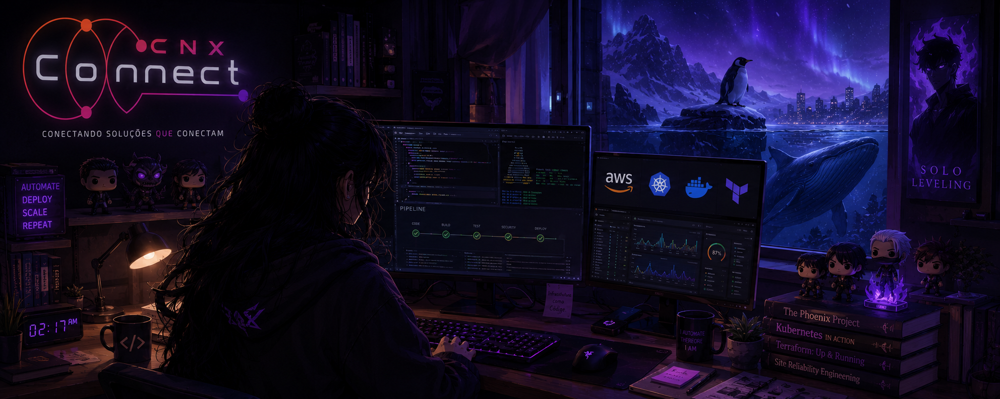
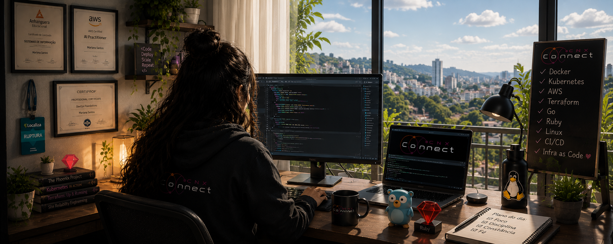

  

 

 

<h1 align="center">
  Duda • Ruby on Rails Engineer ☁️
</h1>

  AWS • Docker • Kubernetes • Linux • CI/CD • Go • Python

  Especialista em automação, infraestrutura cloud e pipelines CI/CD.
  Construindo ambientes seguros, reproduzíveis e escaláveis para produção.

 

  <h3>☁️ Cloud • DevOps • Infraestrutura</h3>

  

  <h3>⚙️ Back-End • Automação • APIs</h3>

  

  <h3>🎨 Front-End • Ferramentas</h3>

  

 

  

---
## 👋 Sobre Mim

Sou profissional focada em **DevOps e Cloud Computing**, atuando na construção de ambientes modernos que conectam desenvolvimento, infraestrutura e automação.

Tenho experiência prática criando e operando pipelines CI/CD, ambientes Linux, containers Docker e infraestrutura AWS, sempre com foco em automação, segurança e estabilidade em produção.

<table>
<tr>
<td width="50%">

### 🏆 Destaques

🎓 Bolsista da Jornada Tech AWS — Santander

☁️ Experiência prática com AWS e Linux

🚀 Deploys automatizados em produção

⚙️ Pipelines CI/CD utilizando GitHub Actions

🔐 Segurança, SSH, Secrets e ambientes produtivos

🦫 Desenvolvimento e automação com Go e Python

</td>

<td width="50%">

### 🚀 Experiência de Mercado

✅ Deploy de aplicações em AWS EC2

✅ Conteinerização com Docker e Docker Compose

✅ Integrações de APIs e aplicações Full Stack

✅ Automação de deploys via SSH

✅ Configuração de Nginx e servidores Linux

✅ Health Checks e monitoramento de aplicações

</td>
</tr>
</table>

## ⚡ Competências Técnicas

<table>
<tr>
<td width="50%" valign="top">

### ☁️ Cloud & Infraestrutura

- AWS EC2
- Linux Administration
- Nginx
- PostgreSQL
- SSH & Security
- Cloud Computing

</td>

<td width="50%" valign="top">

### ⚙️ DevOps & Automação

- GitHub Actions
- CI/CD Pipelines
- Docker
- Docker Compose
- Deploy Automation
- Environment Management

</td>
</tr>

<tr>
<td width="50%" valign="top">

### 💻 Desenvolvimento

- Go
- Python
- Ruby on Rails
- APIs REST
- Integrações de Sistemas

</td>

<td width="50%" valign="top">

### 📚 Atualmente Aprimorando

- Kubernetes
- Terraform
- Infrastructure as Code
- Cloud Native
- Observabilidade

</td>
</tr>
</table>

---

## 📊 GitHub Analytics

  

